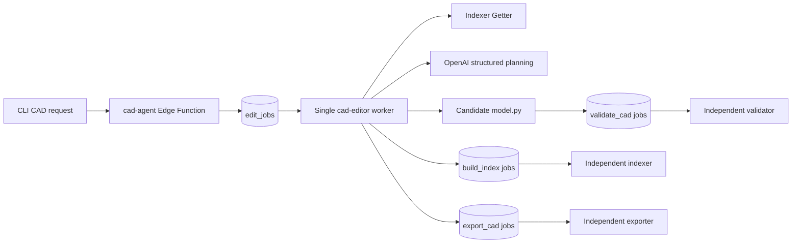

# Project-Scoped CAD Editor

The CAD editor turns a plain-language request into a validated source update
for one CAD database part. It also creates the first model for a linked blank
CAD part. It coordinates the existing indexer, validator, and exporter workers
while keeping their responsibilities independent.

Its main safety rule is:

> Canonical `model.py` is not changed until a hash-bound candidate has passed
> validation.

There is exactly one `cad-editor` worker process and one Compose service. It
handles target resolution, OpenAI planning, deterministic source edits, repair
attempts, commit, reindexing, and export handoff sequentially.

## System Boundaries



The Edge Function only validates input and queues an edit. It does not call
OpenAI for CAD, edit source, or wait for completion. Mesh chat retains its
existing direct generation path.

The validator decides whether a candidate is safe and geometrically valid. The
indexer owns index construction and retrieval. The exporter owns artifact
generation. None of those workers contains AI or edit orchestration logic.

## End-to-End Flow

An established-part edit moves through these logical phases:

1. **Ensure index**: Load the project index and compare it with current
   indexable CAD part IDs, names, and source hashes. A missing or stale index
   causes a full index build.
2. **Resolve target**: When the request carries `requested_part_id`, use that
   linked part as the authoritative target and expose its existing features for
   editing or extension. Otherwise search project CAD features and resolve one
   database part.
3. **Build context**: Retrieve only selected decorators, function bodies,
   referenced parameters, dependency summaries, recent messages, and hashes.
4. **Plan**: Ask OpenAI for a Pydantic-validated structured edit plan. The
   model cannot write a patch or choose arbitrary source ranges.
5. **Apply**: Resolve server-owned target IDs to AST-derived ranges, verify the
   base hash, and apply allowed replacements in descending source order.
6. **Validate**: Store the candidate outside canonical source and queue the
   validator against its exact path and SHA-256 hash.
7. **Repair if needed**: For a repairable in-scope failure, combine failed
   candidate chunks, diagnostics, and accepted Getter context, then plan a
   repair against the latest candidate.
8. **Commit**: Verify validation proof and the unchanged accepted-source hash
   before uploading to canonical `model.py`.
9. **Reindex and export**: Reindex the project, verify target retrieval, then
   queue a hash-bound CAD export.

## Initial CAD Design

New CAD parts start with only the system-owned runtime import:

```python
from cadquery_runtime import cad_part, cq, dataclass
```

Part creation immediately queues an asynchronous `build_index` job. The blank
marker is deliberately excluded from index source signatures, so a blank-only
project produces a valid empty index and a mixed project indexes its established
parts. If that job cannot be queued, part creation still succeeds and the API
returns `index_status = "not_queued"` with a warning to request indexing.

The first chat request for a linked part with exactly that source queues an
`initial_design` workflow. The editor first waits for or creates a fresh project
index, then deliberately skips Getter target resolution because a blank part
has no `ModelParams` or semantic features to index.
OpenAI returns a complete AI-owned model body containing `ModelParams`, one or
more decorated CAD features, and `build_model`. The worker adds the system
import, writes a hash-bound candidate, validates it, then commits, indexes, and
queues export using the same proof and rollback rules as an established edit.

Initial-design repairs replace the entire AI-owned body from validator
diagnostics. Once indexed, the part is an established part and future requests
use the scoped operations below. Existing parts, including legacy starter-model
parts, are never reset automatically.

The top-level job status is `queued`, `running`, `completed`, `failed`, or
`cancelled`. The detailed `state` identifies the current phase, such as
`resolving_target`, `validating_candidate`, or `reindexing`.

## Target Resolution

The editor searches namespaced semantic features from the project Getter. A
feature identity is `(part_id, semantic_id)`, so two database parts may both
contain a feature named `mount_holes`.

Resolution is bounded:

- Search the raw request and retain at most five candidates.
- Automatically select a score of at least `0.80` when it leads the next
  candidate by at least `0.10`.
- With no matches, ask OpenAI once for one to three concrete search phrases.
- For ambiguous matches, ask OpenAI to select from candidate metadata only.
- Reject selections that invent an ID, span parts, or contain no target.

Only the resolved database part may be modified. A linked CAD part is persisted
as `edit_jobs.requested_part_id` and is authoritative even when the request
would rank a feature from another part more highly. All existing semantic
features in that linked part are made available so a plan can extend it. When
no CAD part is linked, the editor retains project-wide semantic resolution.

## Focused OpenAI Context

`context_builder.py` creates the smallest useful planning boundary:

- Selected decorator and function source.
- Referenced `ModelParams` fields.
- One-level semantic dependency summaries.
- Recent user and assistant messages.
- Accepted source hashes.
- Server-owned target IDs with exact allowed regions.

It does not send complete project files, unrelated parts, or source history.

`agent.py` uses the Python Responses API with Pydantic Structured Outputs and
explicit refusal handling, following the official
[Structured Outputs contract](https://developers.openai.com/api/docs/guides/structured-outputs).
`OPENAI_MODEL` is configurable and defaults to `gpt-5.4-mini`.

## Allowed Operations

| Operation | Allowed change |
| --- | --- |
| `replace_parameter_field` | Replace one existing annotated `ModelParams` field while preserving its name |
| `update_cad_part_metadata` | Change role, parameters, dependencies, and search keys on an existing feature |
| `replace_function_body` | Replace statements inside an existing function without changing its signature |
| `add_model_parameter` | Insert one new validated annotated field with a default into `ModelParams` |
| `add_private_helper` | Insert one undecorated private synchronous helper function |
| `add_cad_feature` | Insert one public feature function while server code renders its markers and strict `@cad_part` metadata |
| `replace_build_model_body` | Replace only the statements in `build_model` so new features can participate in the returned model |

Existing semantic IDs and `library="cadquery"` are immutable. Additive
operations reject duplicate parameter, function, and semantic names; unknown
parameters or dependencies; model-supplied decorators; imports; invalid Python
shapes; and changes outside the requested part. The editor cannot remove
features, create files, add imports, or replace an established whole file.
Those restrictions do not prevent the one initial-design workflow from
creating the first valid model body.

`targets.py` derives allowed offsets from Python AST nodes. `applier.py`
rejects unknown targets, wrong operation/target combinations, duplicate or
overlapping regions, invalid replacement shapes, base-hash mismatches, and a
result that no longer parses. Unrelated text is preserved because the model
never generates or applies a whole-file patch.

## Validation And Repair

Candidates are stored at:

```text
<project_id>/candidates/cad/<part_id>/<edit_job_id>/attempt-<n>/model.py
```

The original accepted source is backed up under the same edit prefix until
reindexing succeeds. Candidate validation jobs record the exact path, hash,
owning `edit_job_id`, and `source_kind = "candidate"`.

The validator runs stages in this order:

```text
syntax -> runtime_contract -> decorator_validation ->
reference_validation -> security -> cadquery_runtime -> geometry
```

It stops after the first failed stage and returns schema-v2 diagnostics with
stable error codes and source/symbol context. Legacy `valid`, `checks`, and
`runtime` fields remain for compatibility.

One edit may create at most three validation attempts: the initial candidate
and at most two repaired candidates. Repairs apply to the latest failed
candidate, never the original source. Timeouts, infrastructure errors, hash
mismatches, out-of-scope diagnostics, source races, and explicit
non-repairable hints stop immediately.

## Commit, Rollback, And Export

Before commit, the editor verifies:

- The completed validation job belongs to this edit.
- It validated the current candidate path and hash.
- Its result has both `status = "passed"` and legacy `valid = true`.
- Canonical source still matches the accepted hash.

After upload, canonical source is downloaded and hash-verified. A full project
reindex must then produce a fresh Getter that can retrieve all resolved
semantic targets.

If reindexing fails, canonical source is restored only when it still equals the
editor candidate hash. Independently changed source is never overwritten.
Export queue failure does not roll back a valid, indexed edit; the job
completes with a warning and `/export <partId>` remains available.

The candidate prefix is removed after every terminal outcome. Project and part
deletion cancel applicable queued edits and block applicable running edits.

## Restart Safety

`edit_jobs` is the durable workflow record. It stores the target, attempt,
hashes, candidate path, child IDs, concise history, result, errors, and lease
timestamps.

Every external side effect is persisted before advancing:

- Candidate creation is recorded before validation is queued.
- Validation, indexing, and export RPCs atomically save their child job ID.
- Existing child IDs are reused after restart.
- A committed candidate is recognized by hash and is not uploaded twice.
- Expired editor leases can be reclaimed.

This makes orchestration boundaries idempotent. OpenAI planning itself is not
assumed deterministic; persisted plans and candidates prevent regeneration
after later side effects.

## Module Responsibilities

| Module | Responsibility |
| --- | --- |
| `edit_worker.py` | Claim leased jobs and run one sequential worker loop |
| `orchestrator.py` | State transitions, child jobs, commit, rollback, cleanup |
| `repository.py` | Supabase, RPC, Storage, and hash boundaries |
| `resolver.py` | Bounded Getter search and one-part selection |
| `context_builder.py` | Focused accepted and repair contexts |
| `agent.py` | Structured OpenAI calls and refusal handling |
| `contracts.py` | Strict Pydantic contracts and workflow errors |
| `targets.py` | AST-derived server-owned edit regions |
| `applier.py` | Scope checks and deterministic text replacement |
| `error_classifier.py` | Repairable versus terminal validation outcomes |

This keeps probabilistic decisions in `agent.py`, deterministic source mutation
in `applier.py`, and external business workflow in `orchestrator.py`.

## Running Locally

Create `workers/cad_editor/.env` with:

```dotenv
SUPABASE_SERVICE_ROLE_KEY=...
OPENAI_API_KEY=...
OPENAI_MODEL=gpt-5.4-mini
```

Start the indexer and validator first, then the one editor service:

```bash
docker compose \
  --env-file workers/cad_editor/.env \
  -f workers/cad_editor/docker-compose.yml \
  up --build
```

The default Docker Supabase URL is
`http://host.docker.internal:54321`. Override it with
`SUPABASE_URL_DOCKER` when needed.

From the CLI:

```text
/link -project Desk Mount
make the mounting holes deeper
/edit-status <edit_job_uuid>
```

The request returns immediately. `/edit-status` prints state, attempts,
targets, diagnostics, changed symbols, and validation/index/export child IDs.

## MVP Limits

- CAD only; mesh behavior is unchanged.
- One canonical `model.py` per database CAD part.
- One resolved database part per edit.
- Safe parameter, private-helper, and semantic-feature addition; no feature or
  file deletion.
- No arbitrary patches, source execution by the editor, embeddings, vector
  search, or parallel editor workers.
