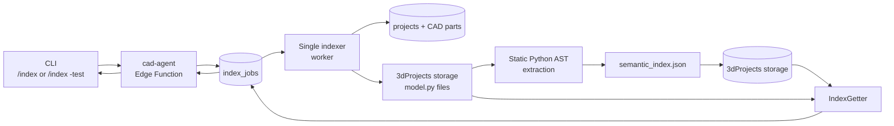

# CAD Project Indexer

The indexer builds a searchable map of every CAD model in a project. It lets
the application answer:

> Which model and which small section of Python source are relevant to this
> request?

It performs static analysis only. It does not execute CadQuery, call AI, or
modify model source.

## Mental Model

A project can contain multiple database CAD parts. Each database part has one
stored `model.py`, and that file can contain multiple semantic CAD features
declared with `@cad_part(...)`.

For example:

```text
Project: Desk Mount
  Database part: Left Bracket
    Semantic feature: wall_plate
    Semantic feature: mount_holes
  Database part: Right Bracket
    Semantic feature: wall_plate
    Semantic feature: mount_holes
```

Semantic IDs only need to be unique within one database part. The indexer
therefore identifies a feature with:

```text
(database part_id, semantic_id)
```

This prevents two models that both contain `mount_holes` from overwriting or
being confused with each other.

## System Integration



The CLI never talks directly to the worker. The Edge Function validates the
request and creates an `index_jobs` row. The worker claims the oldest queued
job through a service-role-only database function.

There is one worker process and one Docker Compose service. That worker handles
both index creation and manual Getter tests.

## Job Types

The worker processes two job types:

| Job type | Purpose | Writes an index? |
| --- | --- | --- |
| `build_index` | Scan and index every CAD part in a project | Yes |
| `test_getter` | Search an existing index with raw request text | No |

Job state and results are stored in `index_jobs`. Operational exceptions mark
the job as `failed`; valid Getter outcomes such as `stale_index` or `no_match`
are completed results.

## Building an Index

Running `/index <project_id>` starts this flow:

1. The Edge Function confirms that the project exists and has at least one CAD
   part.
2. A `build_index` job is queued. Only one queued or running build is allowed
   per project.
3. The worker reads the project name and lists only records where
   `part_type = 'cad'`. Mesh parts are ignored.
4. `repository.py` downloads each canonical source file from:

   ```text
   <project_id>/parts/cad/<part_id>/model.py
   ```

5. Each source is decoded as UTF-8 and assigned a SHA-256 content hash.
6. `extractor.py` parses the source with Python's built-in `ast` module. The
   source is never imported or executed.
7. `index_builder.py` combines the extracted records into one deterministic
   project index.
8. The sources are read a second time. If part names, part IDs, or hashes
   changed while indexing, the job fails instead of publishing a mixed
   snapshot.
9. The completed JSON document is uploaded to:

   ```text
   <project_id>/index/semantic_index.json
   ```

The existing index is not touched until all source files parse and validate.
This preserves the previous usable index when a new build fails.

## AST Extraction

For every `model.py`, the extractor records:

- `ModelParams` field names, annotations, defaults, and line ranges.
- Top-level function names and line ranges.
- The single `build_model` entry point.
- Public functions decorated with `@cad_part(...)`.
- Semantic IDs, roles, parameters, dependencies, search keys, and source
  boundaries from those decorators.

The decorator metadata is the semantic layer that connects user language to
code. A function name describes implementation, while `role` and `search_keys`
describe what a user may call the feature.

The extractor rejects an invalid model when:

- `ModelParams`, `build_model`, or semantic feature functions are missing.
- Decorator fields are missing, reordered, nonliteral, or use the wrong types.
- `library` is not `"cadquery"`.
- A decorator references an unknown `ModelParams` field.
- A dependency references an unknown semantic ID in the same database part.
- Semantic IDs are duplicated within one database part.

Private helpers and `build_model` are recorded as functions when applicable,
but they are not treated as searchable semantic features.

## Index Contents

The index stores metadata and source coordinates, not duplicated source code.
A simplified shape is:

```json
{
  "schema_version": 1,
  "project_id": "...",
  "generated_at": "...",
  "files": [
    {
      "part_id": "...",
      "part_name": "Left Bracket",
      "path": ".../model.py",
      "content_hash": "..."
    }
  ],
  "parts": [
    {
      "part_id": "...",
      "model_params": [],
      "functions": [],
      "cad_parts": [],
      "build_model": {}
    }
  ]
}
```

Keeping source out of the index avoids maintaining two source-of-truth copies.
When source is requested, the Getter uses the saved line range against the
current `model.py`.

## Getter Logic

Running `/index -test <request>` queues a `test_getter` job for the linked
project.

The Getter first checks freshness:

- The indexed and current CAD part IDs must match.
- Part names must match.
- Every current source hash must match its indexed hash.

If any check differs, the result is `stale_index` and the user must explicitly
run `/index <project_id>` again. Retrieval never silently rebuilds the index.

For a fresh index, each semantic feature is scored against the request using:

1. Exact normalized matches.
2. Phrase containment.
3. Token overlap.
4. `SequenceMatcher` similarity for small spelling mistakes.

Searchable values include database part names, semantic IDs, roles, function
names, parameter names, and search keys. Semantic fields are weighted above the
database part name so a request such as "make the Left Bracket mounting holes
bigger" prefers `mount_holes` instead of an unrelated feature in that model.

The Getter returns at most five ranked candidates. For the highest-ranked
candidate it also returns:

- The exact decorator and function source range.
- Referenced `ModelParams` records.
- One-level dependency summaries.
- The current file hash.

Dependency source is not included automatically. The focused result is meant
to remain small enough for inspection now and future AI use later.

## Module Responsibilities

| Module | Responsibility |
| --- | --- |
| `index_worker.py` | Poll jobs, record completion/failure, and log outcomes |
| `indexer/service.py` | Coordinate build and Getter-test workflows |
| `indexer/repository.py` | Isolate Supabase database and storage access |
| `indexer/models.py` | Define the source-file boundary and indexing error |
| `indexer/extractor.py` | Parse and validate one CAD model with Python AST |
| `indexer/index_builder.py` | Assemble the project index and build summary |
| `indexer/getter.py` | Check freshness, rank matches, and retrieve context |

The separation is intentional:

- AST and search logic can be tested without Supabase.
- Storage paths and API calls stay in one adapter.
- The worker loop does not need to understand index structure.
- Future AI integration can call the Getter without changing index creation.

## Important Guarantees

| Guarantee | Why it matters |
| --- | --- |
| Static parsing only | Untrusted or broken model source is never executed |
| One project index | Retrieval has one consistent view of all CAD parts |
| SHA-256 freshness | Source context is never returned from a known-stale index |
| Publish after validation | A failed build does not replace the previous index |
| Per-part semantic namespace | Reused feature names across models remain safe |
| One worker service | Build and test jobs have simple, predictable ordering |
| Explicit reindexing | Index creation and retrieval remain separate operations |

## Running Locally

Create `workers/indexer/.env` with:

```dotenv
SUPABASE_SERVICE_ROLE_KEY=...
```

Start the worker:

```bash
docker compose \
  --env-file workers/indexer/.env \
  -f workers/indexer/docker-compose.yml \
  up --build
```

The default Docker Supabase URL is `http://host.docker.internal:54321`. It can
be overridden with `SUPABASE_URL_DOCKER`. The worker polls every two seconds by
default; `INDEX_POLL_INTERVAL_SECONDS` changes that interval.

From the application CLI:

```text
/index <project_uuid>
/link -project <project name>
/index -test make the mounting holes bigger
```

The build command returns immediately with a job ID. The test command waits up
to 60 seconds and prints the ranked matches and focused context.

## Expected Getter Outcomes

| Status | Meaning | Action |
| --- | --- | --- |
| `ok` | Relevant candidates and focused context were found | Inspect the result |
| `no_match` | No candidate passed the relevance threshold | Improve semantic metadata or query |
| `missing_index` | The project has not been indexed | Run `/index <project_id>` |
| `stale_index` | CAD parts or source changed after indexing | Run `/index <project_id>` again |
| Failed job | Storage, parsing, validation, or infrastructure failed | Inspect `error_message` and worker logs |

## MVP Boundaries

The indexer currently assumes one `model.py` per database CAD part. It does not
support recursive project files, mesh indexing, incremental updates,
embeddings, vector search, source editing, automatic reindexing, or AI calls.

Those concerns are deliberately outside this module. Its responsibility is:

```text
CAD source -> validated semantic index -> focused read-only context
```
