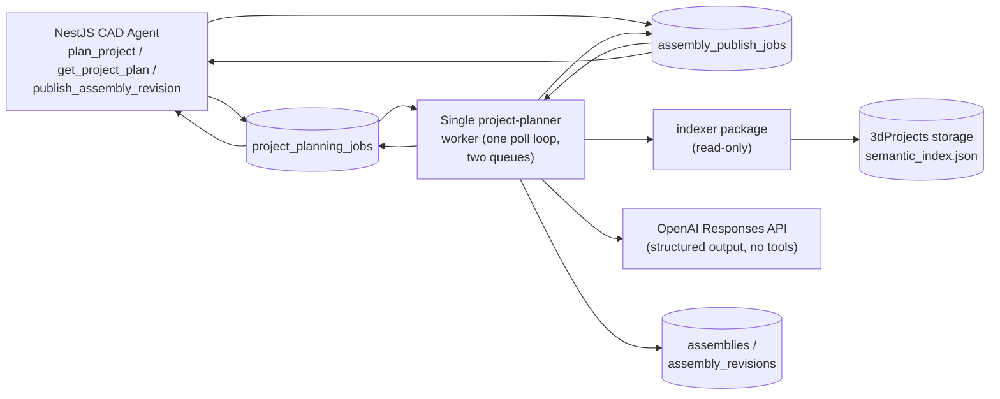

# Project-Scoped AI Planner

This worker answers one question:

> Given a project-level request, what physical parts does it require, what
> is each one responsible for, and how do they conceptually connect?

It performs one blocking LLM call per job. It does not execute CadQuery,
does not call any other AI agent, and does not modify or create anything
outside its own job row.

The same process also owns **publishing**: turning a completed plan into a
persisted, immutable `AssemblyRevision`. See
[Publishing (Assembly Revisions)](#publishing-assembly-revisions) below --
by default this stays a separate, explicit step, but a request can opt into
running it automatically right after planning.

## Mental Model

A project-level request ("an adjustable phone stand with a weighted base, a
rotating arm, and a tilting phone holder") may require one part or several.
This worker turns that request into two related artifacts:

- **`project_plan`** -- the planning artifact: what parts are needed, why,
  what each is responsible for, what connects to what, and what assumptions
  were made. Useful for humans and for debugging decomposition quality.
- **`assembly_spec`** -- the canonical blueprint deterministically derived
  from a validated `project_plan`: nodes (one per part, bound to either an
  existing part ID or a "to be created" marker), interfaces between nodes,
  and any genuine execution dependencies. This is what later systems would
  consume -- but no later system exists yet (see below).

The LLM produces only the `project_plan` draft. The `assembly_spec` is
never a second AI output -- it is built by ordinary code from a
plan that has already passed deterministic validation, so the two artifacts
can never disagree with each other.

## System Integration



One worker process claims from both tables each poll tick: `project_planning_jobs`
first (the slower, LLM-bound work), then `assembly_publish_jobs` if no
planning job is waiting. The two job types share this process because their
domain code was already one shared package (`project_planner/`) -- nothing
justified a second deployable once publishing could also be triggered
inline from the planning job itself (`auto_publish`, below).

## Job Lifecycle

1. A `project_planning_jobs` row is inserted with `status='queued'`.
2. This worker polls and claims it via `claim_next_project_planning_job()`.
3. It builds a snapshot of the project's existing indexed CAD parts
   (`context_builder.py`, reusing `workers/indexer/indexer`'s
   `SupabaseProjectRepository`/`IndexGetter` unmodified).
4. It calls the OpenAI Responses API once, with structured output and no
   tools (`planner.py`), producing a `ProjectPlanDraft`.
5. If `clarification.required` is true, the job ends `failed` with
   `error_code='PROJECT_CLARIFICATION_REQUIRED'` -- the same way the
   existing CAD editor treats a `CadGoal`'s clarification.
6. Otherwise, the draft is deterministically validated (`validator.py`):
   unique/known part refs, valid interface endpoints, no self-interfaces,
   unique interface refs, acyclic execution dependencies, full requirement
   coverage, and configured complexity limits. Every check the repair loop
   can retry against also runs here -- there is no separate, stricter rule
   set applied only at publish time (see below).
7. A validated plan is deterministically converted into an `AssemblySpec`
   (`spec_builder.py`) -- server-generated IDs only, no second LLM call.
8. The job ends `completed` with both `project_plan` and `assembly_spec`
   populated. If the request had `auto_publish=true`, the worker
   immediately continues into the publish lifecycle below, in the same
   tick -- see [Publishing (Assembly Revisions)](#publishing-assembly-revisions).

Either way -- `completed` or `failed` -- the worker also writes one
human-readable text file per job to `workers/project_planner/logs/<job_id>.txt`
(`planning_log.py`, mirroring `workers/agent_3d/planning/planning_log.py`):
the request, any repair attempts (draft + violations per attempt), the
final `project_plan`/`assembly_spec` on success, or the failure code/message
on failure. This is a debugging/review convenience, not part of the
pipeline's real result -- unlike agent_3d's planning log, a write failure
here is logged and swallowed rather than failing the job, since the job's
actual result already lives durably in `project_planning_jobs`. A reclaimed
job overwrites the same file (named by job id) instead of creating
duplicates. Set `PROJECT_PLANNER_LOG_DIRECTORY` to change where these are
written; files are created with owner-only `0600` permissions.

## What This Worker Does NOT Do

This is Step 1 of a larger design, and the boundary is deliberate:

- It does not create parts, rows in `parts`, or any storage objects.
- It does not queue `edit_jobs`, `generation_jobs`, or any other job type.
- It does not run CadQuery, generate geometry, or validate anything
  physical.
- It does not fan out into per-part work, schedule anything, or coordinate
  multiple jobs.
- It does not compute assembly transforms, mates, datums, or any geometric
  placement -- `assembly_spec` describes semantic relationships only.
- Publishing (below) never materializes parts either -- it persists the
  plan's own content as an immutable revision, nothing more. No later
  system reads a published `AssemblyRevision` and creates `parts` rows
  from it yet.

A job reaching `completed` means exactly one thing: a validated project
decomposition exists and can be inspected. By default, nothing runs
automatically after that -- publishing is an explicit, separate step unless
a request opts into `auto_publish`. This lets the decomposition/prompt/
validation logic be tested and iterated on in complete isolation from the
mature single-part CAD pipeline, before anything is built to consume an
`assembly_spec`.

## Publishing (Assembly Revisions)

Planning produces a draft; publishing is a distinct decision to commit that
draft, permanently, as one numbered revision of an `assembly`. The two are
kept conceptually separate even though one worker now handles both:

- An **`assembly`** is a stable identity with a `head_revision` pointer.
  Omit a target on publish and a new one is created (revision 1); name an
  existing `assembly_id` and it becomes the next revision.
- An **`assembly_revision`** is immutable once inserted (enforced by a
  Postgres trigger, not just application code) and content-addressed by a
  `definition_digest` -- a SHA-256 hash of the `assembly_spec`'s semantic
  content with every server-generated random ID (`spec_id`, `node_id`,
  `interface_id`) stripped out first, so re-publishing identical content
  (e.g. after a no-op replan) is still detectable as such (`digest.py`).
- **`assembly_part_bindings`** is the live, mutable pointer from an abstract
  node inside a frozen revision to a concrete `parts` row -- deliberately
  decoupled from the revision content itself.

There are two ways a plan gets published:

1. **Explicit, later (`auto_publish=false`, the default).** A completed
   plan just sits there until a separate `publish_assembly_revision` action
   queues an `assembly_publish_jobs` row; this worker claims it on a later
   poll tick and calls `publish_service.process_assembly_publish_job`.
   This is what preserves the original "inspect before it's permanent"
   property: nothing about a plan becomes irreversible just because
   planning succeeded.
2. **Inline (`auto_publish=true`).** Right after the planning job is
   marked `completed`, the *same* job tick calls
   `publish_service.run_auto_publish` directly with the plan/spec already
   in memory -- no second queue round-trip. Use this when the caller
   already trusts the plan and doesn't need a look-before-commit gate
   (e.g. a simple, well-understood edit, or a non-interactive flow).

Either way, publishing always re-validates the plan (`validate_project_plan`,
the same function the repair loop uses) against a **freshly rebuilt**
existing-parts roster immediately before persisting -- not because the rule
set differs, but because the world can change between planning and
publishing (a part referenced as `kind="existing"` could have been deleted
in the meantime), even when that gap is just the length of one job tick.

A failed publish never rewrites the planning job's own `completed` status --
the plan itself was valid; only the publish attempt failed. Both paths
always leave a row in `assembly_publish_jobs` (queued-then-claimed for the
explicit path, created directly as `running` for the inline path), so
`get_assembly_publish_job`/`list_assembly_revisions` show a uniform history
regardless of which path produced a given revision.

### Publish Failure Codes

| Code | Meaning |
|---|---|
| `ASSEMBLY_PUBLISH_DESIGN_REQUEST_NOT_FOUND` | No planning job exists with the given id |
| `ASSEMBLY_PUBLISH_DESIGN_REQUEST_NOT_COMPLETED` | That planning job hasn't reached `completed` yet |
| `ASSEMBLY_PUBLISH_PLAN_INVALID` | Canonical re-validation found violations (see `details.violations`) |
| `ASSEMBLY_PUBLISH_ALREADY_IN_PROGRESS` | Another publish job is already queued/running for this assembly or design request |
| `ASSEMBLY_PUBLISH_FAILED` | The publish RPC didn't return a row, or another unexpected failure |

## Known Step-1 Limitation

Only **indexed CAD parts** are eligible as `kind="existing"` bindings. Mesh
parts are never in the semantic index (the indexer only processes
`part_type='cad'`), so a request to reuse an existing mesh part cannot be
expressed yet.

## Running Locally

```
SUPABASE_URL=...
SUPABASE_SERVICE_ROLE_KEY=...
OPENAI_API_KEY=...
python workers/project_planner/project_planner_worker.py
```

Or via Docker Compose:

```
docker compose -f workers/project_planner/docker-compose.yml up --build
```

This one process claims from both `project_planning_jobs` and
`assembly_publish_jobs` -- there is no separate publisher worker/compose
project to start.

## Environment Variables

| Variable | Default | Purpose |
|---|---|---|
| `SUPABASE_URL` | required | Supabase project URL |
| `SUPABASE_SERVICE_ROLE_KEY` | required | Service-role key (bypasses RLS) |
| `OPENAI_API_KEY` | required | OpenAI API key |
| `OPENAI_PROJECT_PLANNING_MODEL` | falls back to `OPENAI_MODEL`, then `gpt-5.4-mini` | Model used for planning calls |
| `PROJECT_PLANNER_POLL_INTERVAL_SECONDS` | `2` | Poll interval when no job is queued |
| `PROJECT_PLANNING_MAX_PARTS` | `12` | Rejects plans (`PROJECT_PLAN_TOO_COMPLEX`) with more parts than this |
| `PROJECT_PLANNING_MAX_INTERFACES` | `24` | Same, for interfaces |
| `PROJECT_PLANNER_LOG_LEVEL` | `INFO` | Set to `DEBUG` to log full plan/spec/roster payloads |
| `PROJECT_PLANNER_LOG_DIRECTORY` | `workers/project_planner/logs/` | Where per-job planning log text files are written |

## Module Responsibilities

| Module | Responsibility |
|---|---|
| `contracts.py` | Pydantic models for the draft/finalized plan, planner input, assembly spec, and `AssemblyRevision` |
| `context_builder.py` | Builds the existing-parts roster from the project's semantic index |
| `planner.py` | The single structured-output LLM call, no tools |
| `validator.py` | Deterministic post-parse validation of a `ProjectPlan` -- one rule set, used both during planning's repair loop and immediately before publish |
| `spec_builder.py` | Pure `ProjectPlan` -> `AssemblySpec` conversion |
| `digest.py` | Canonicalizes an `AssemblySpec` and computes its `definition_digest` |
| `planning_log.py` | Writes the per-job, human-readable planning log text file |
| `repository.py` | Claim/complete/fail for both `project_planning_jobs` and `assembly_publish_jobs`, plus the `publish_assembly_revision` RPC call, composed with the unmodified indexer repository |
| `service.py` | Orchestrates the planning steps above for one job |
| `publish_service.py` | Orchestrates publishing -- shared by the explicit `/publish` path and the inline `auto_publish` path |
| `failures.py` | `ProjectPlanningFailure`, the failure taxonomy for this worker |

## Failure Codes

| Code | Meaning |
|---|---|
| `PROJECT_PLANNING_FAILED` | Model/API request failed |
| `PROJECT_PLAN_RESPONSE_INVALID` | Structured response could not be parsed/finalized |
| `PROJECT_CLARIFICATION_REQUIRED` | The plan says decomposition-relevant ambiguity remains |
| `PROJECT_PLAN_DUPLICATE_PART_REF` | Two parts share the same `ref` |
| `PROJECT_PLAN_UNKNOWN_PART` | An `existing` binding isn't in the supplied roster, or a `new`/`existing` binding shape is wrong |
| `PROJECT_PLAN_INVALID_INTERFACE` | An interface references an unknown part, or connects a part to itself |
| `PROJECT_PLAN_DUPLICATE_INTERFACE_REF` | Two interfaces share the same `ref` |
| `PROJECT_PLAN_INVALID_DEPENDENCY` | An execution dependency references an unknown part |
| `PROJECT_PLAN_EXECUTION_DEPENDENCY_CYCLE` | Execution dependencies are not acyclic |
| `PROJECT_PLAN_REQUIREMENT_UNADDRESSED` | A requirement isn't addressed, or an addressed ref doesn't exist |
| `PROJECT_PLAN_TOO_COMPLEX` | Plan exceeds `PROJECT_PLANNING_MAX_PARTS`/`PROJECT_PLANNING_MAX_INTERFACES` |
| `PROJECT_INDEX_MISSING` | Project has CAD parts but was never indexed |
| `PROJECT_INDEX_STALE` | Project's semantic index doesn't match its current CAD sources |

See [Publish Failure Codes](#publish-failure-codes) above for
`ASSEMBLY_PUBLISH_*` codes.
